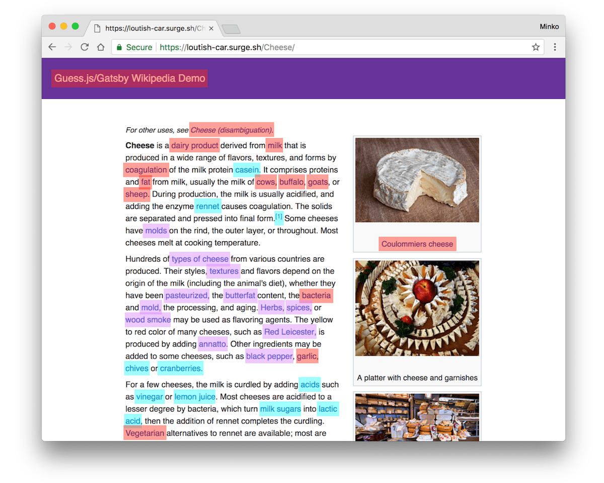

import { Card } from '@fusuma/client';

<!-- sectionTitle: Angular Meetup & builderscon 参加レポート -->

<h1>Angular Meetup & builderscon  参加レポート</h1>

2019/09/04 SPD若手LT会

花房亮

---

<!-- sectionTitle: 自己紹介 -->
<!-- note
自己紹介
- Shopらんチーム所属
- フロントエンドエンジニア (?)
  - AngularとちょっとだけJava
- 好きなエディタはVim
- 最近筋トレと自炊を再開した
  - もっと健康的な生活を送りたい

Vim -> このスライドもVimで書いた
ほうれん草、キウイ、ブルーベリー、赤たまねぎ、くるみ
ほうれん草とブルーベリーに含まれるは脳の劣化を防いでくれる
-->

<Card
  left={}
  right={
    

      <h2>自己紹介</h2>
      <ul>
        <li>Shopらんチーム所属</li>
        <li>新卒2年目</li>
        <li>
フロントエンドエンジニア (?)

          <ul>
            <li>AngularとちょっとだけJava</li>
          </ul>
        </li>
        <li>好きなエディタはVim</li>
        <li>
最近筋トレと自炊を再開した

          <ul>
            <li>もっと健康的な生活を送りたい</li>
          </ul>
        </li>
      </ul>
    

  }
/>

---
<!-- sectionTitle: Angular Meetup feat. Minko Gechev from Angular team -->
<!-- note
Angular Meetup
- Minko Gechev
  - GoogleのAngularチームの人
- JiaLi Passion
  - Angular Collaborator
  - Zone.jsをつくった人

Zone.jsはAngularの非同期処理のユーティリティライブラリ
-->

<Card
  left={}
  right={
    

        <h2>Angular Meetup</h2>
        <ul>
            <li>
Minko Gechev

                <ul>
                    <li>GoogleのAngularチームの人</li>
                </ul>
            </li>
            <li>
JiaLi Passion

                <ul>
                    <li>Angular Collaborator</li>
                    <li>Zone.jsをつくった人</li>
                </ul>
            </li>
        </ul>
    

  }
/>

---

<!-- note
- フロントエンドアプリケーションではJSのダウロードサイズを小さくするのは重要
- Lazy loading
  - ルーティングごとに必要なモジュールだけを読み込む
- Preloading
  - モジュールの先読み
  - Angularは設定一つで有効になる
  - Predictive Prefetching (Guess.js)

特に初回読み込み。SEOでも重要。
lazy loading: Angularではアプリをモジュール単位に分割する。URLが切り替わる->必要なモジュールを読み込む
prefetching: バックグラウンドでJSをダウンロードしておく。
Angularの設定だとページ上のすべてのリンクのモジュールが先読みされる
-->

## Tools for Fast Angular Applications

- フロントエンドアプリケーションではJSのダウロードサイズを小さくするのは重要
- Lazy loading
  - ルーティングごとに必要なモジュールだけを読み込む
- Preloading
  - モジュールの先読み
  - Angularは設定一つで有効になる
  - Predictive Prefetching (Guess.js)

---
<!-- note
スクロール位置に見えているリンクのモジュールだけ先読みしてくれるすごいやつ
-->

<Card
  left={}
  right={
    

      <h2>ngx-quicklink</h2>
      
スクロール位置に<strong>見えている</strong>リンクの

モジュールだけ先読みしてくれるすごいやつ

    

  }
/>

---
<!-- note
Guess.js
- 現在アルファ版
- AngularだけでなくReactにも対応
- Google Analyticsを元に予測
- Markov Chainでグラフを作成し、RNNで学習
- ライブラリ自体、モデル共に軽量
-->

<Card
  left={
    

      
      
引用: https://blog.mgechev.com/2018/05/09/introducing-guess-js-data-driven-user-experiences-web/

    

  }
  right={
    

      <h2>Guess.js</h2>
        <ul>
          <li>AngularだけでなくReactにも対応</li>
          <li>Google Analyticsを元に予測</li>
          <li>Markov Chainでグラフを作成し、RNNで学習</li>
          <li>ライブラリ自体、モデル共に軽量</li>
        </ul>
    

  }
/>

---

<!-- note
My journey to ngrx/data
- ngrxをラップしたライブラリ
  - ngrxはAngularにおけるRedux
- Facadeパターンでngrxを隠蔽
- ソースコードを読むとngrxおよびRxJSのベストプラクティスが詰まっている
  - ngrxを使い始めるならおすすめ

ngrx, ReduxはFlux思想に基づいた状態管理ツール
-->

<Card
  left={
    

      
      
引用: https://slides.com/jiali/deck-5#

    

  }
  right={
    

      <h2>My journey to ngrx/data</h2>
        <ul>
          <li>
ngrxをラップしたライブラリ

            <ul>
              <li>ngrxはAngularにおけるRedux</li>
            </ul>
          </li>
          <li>
ngrx / RxJSのベストプラクティスが詰まっている

            <ul>
              <li>ngrxを使い始めるならおすすめ</li>
            </ul>
          </li>
        </ul>
    

  }
/>

---

<!-- note
- 英語わからん
- 質疑応答は通訳あった
- 新鮮な情報、ここでしか聞けない情報が聞けた
- 直接要望を伝えることができるのはつよい

数日前の開発状況や次のバージョンの情報、Angularチーム内のことなど
Angularチームの人数
angular-eslint
-->

## Angular Meetupを参加してみて

- 英語わからん
- 質疑応答は通訳あった
- 新鮮な情報、ここでしか聞けない情報が聞けた
- 直接要望を伝えることができるのはつよい

---

<!-- sectionTitle: builderscon -->
<!-- note
builderscon
- buildersconは、「知らなかった、を聞く」 をテーマとした技術を愛する全てのギーク達のお祭りです
- 前夜祭を含めると3日間開催された
- 技術の幅が広い
  - ジャンルは何でもあり
- 発表の質が高い
  - プロポーザルを出して選考を通らなければならない

聞いた中で特に面白いと感じたセッションを３つ紹介

目的: 面白そうだから。まずイベントのコンセプトが面白そう。
普段自分の専門領域を深めに勉強会などに行くが、単純に面白そうなことに出会いたいと思った
-->
<Card
  left={

}
  right={
    

      <h2>builderscon</h2>
        <ul>
          <li>「知らなかった、を聞く」 技術者の祭典</li>
          <li>前夜祭を含めると3日間開催された</li>
          <li>
技術の幅が広い

            <ul>
              <li>ジャンルは何でもあり</li>
            </ul>
          </li>
          <li>
発表の質が高い

            <ul>
              <li>プロポーザルを出して選考を通らなければならない</li>
            </ul>
          </li>
        </ul>
    

  }
/>

---
<!-- note
対戦ゲームに学ぶ、フレームワークの設計技法とAIのアルゴリズム入門 by qsona
- 対戦ゲームのルールを定式化
- 定式化するとゲームのAIに活かせる
- boadgame.ioに学ぶフレームワーク設計の勘所
-->
<h2>
対戦ゲームに学ぶ、
フレームワークの設計技法とAIのアルゴリズム入門 by qsona</h2>

- 対戦ゲームのルールを定式化
- 定式化するとゲームのAIに活かせる
- boadgame.ioに学ぶフレームワーク設計の勘所

---

<!-- note
対戦ゲームのルールを定式化
- ターン制のゲームは状態(局面)とMove(指し手)の組み合わせで表現できる
  - 初期状態
  - 終了条件と結果(勝敗)
- ただし、(将棋の場合)ルールが曖昧で完全に定式化できない
  - 「最後の審判」(1997)

将棋だと局面は9x9のマスとコマの配置、持ち駒など
最後の審判: 詰将棋、現行のルールでは勝ち負けが不定となるのが定説とされる

-->

## 対戦ゲームのルールを定式化

- ターン制のゲームは状態(局面)とMove(指し手)の組み合わせで表現できる
  - 初期状態
  - 終了条件と結果(勝敗)
- ただし、(将棋の場合)ルールが曖昧で完全に定式化できない
  - 「最後の審判」(1997)

---

<!-- note
定式化するとゲーム木という木構造で表せる
- 状態(局面)がノード、Move(指し手)が枝
- ゲームの面白さを表せるのではないか
  - 一方的なゲーム(消化試合)
  - 緊張感が持続するゲーム

-->

<Card
  left={
    

      
      
引用: https://www.webcyou.com/?p=6997

    

  }
  right={
    

      <h3>定式化するとゲーム木で表せる</h3>
        <ul>
          <li>状態(局面)がノード、Move(指し手)が枝</li>
          <li>
            
ゲームの面白さを表せるのではないか

            <ul>
              <li>一方的なゲーム(消化試合)</li>
              <li>緊張感が持続するゲーム</li>
            </ul>
          </li>
        </ul>
    

  }
/>

---

<!-- note
対戦ゲームに学ぶ、フレームワークの設計技法とAIのアルゴリズム入門 by qsona
- 対戦ゲームのルールを定式化
  - ターン制のゲームは状態(局面)とMove(指し手:副作用のない関数みたいなもの)の組み合わせで表現できる
  - 状態から状態の遷移を木構造で表現(ゲーム木)
    - ゲーム木は人間の感じた方とリンクしている -> ゲームの面白さを表せられるのでは
      - 一方的なゲーム(次の手で自分が勝てる選択肢を選べる場合)
      - 緊張感が持続するゲーム(相手の選択肢次第では負けるかもしれない)
  - 将棋は禁じ手がありルールが曖昧なため定式化が難しい
- 定式化するとゲームのAIに活かせる
  - モンテカルロ木探索
    - とりあえず、ゲーム終了まで何回も試行する
    - 勝率が高い手を選ぶ
  - いくつかの戦略を一定の割合で混ぜると強い(例：ポーカーで2割ブラフ)
  - 将棋は完全解析不能なので評価関数が命
  - 
- boadgame.ioに学ぶフレームワーク設計の勘所
  - boadgame.io
    - ターン制のゲームを作るためのフレームワーク
    - JavaScript, Node.js, React, TypeScript
  - 良いフレームワークとは
    - 対象の構造を適切に捉えていて頑健性がある
    - エコシステムの充実
  - (将棋) 局面を状態(G)として管理、指し手の履歴もゲームの状態に含まれる
    - 履歴がないと千日手の判定ができない
  - PDS (プレゼンテーションとドメインの分離)
  - 簡易AIの自動生成(モンテカルロ木ベース)
---

<!-- note
コンパイラをつくってみよう by DQNEO
- ライブコーディング形式のセッション
  - 実際は会場全体でモブプロ状態だった
- 四則演算が書かれた単純なソースコードを入力としてアセンブリを標準出力として吐く
- バイト列から文字を認識-> Tokenizer(字句解析) -> Parser(構文解析) 
- コンパイラをつくりはじめるのに特殊な知識はいらない(言語はなんでもよい)
- 作りながら学ぶというやり方がおすすめ
- 今ならchibiccを写経するのがいい
-->

---

<!-- note
Oxygen Not Included: Making a Game That Inspires Science by Ipsquiggle
- 物理学や科学のルールを持ち込んだシミュレーションゲーム
- 街づくり + サバイバルがコンセプト(シムシティに代表されるジャンル)
- 物理法則
  - 重力
  - 熱伝導
  - 副作用
- 電球をつけたい -> 発電機を作る -> 熱と二酸化酸素という副作用が出る
- ONIは科学するということを内発的に動機づけるゲーム
  - ゲーム上の試行錯誤: 仮説を立てる -> 実験 -> 考察 の繰り返し
  - プログラミングの醍醐味に通づる物がある
-->

---

<!-- note
ほかにも面白い(面白そうだった)発表がたくさんあった
- PHPでJVMをつくった人
- 自動作曲入門
- Kyash, メルペイのアーキテクチャ
- スーパーカミオカンデの開発裏話
- webpack / Babelがどう動いているか解説
-->

---
<!-- note
豪華なディナー
-->

---

<!-- note
最後にbuildersconで一番心に残った言葉で締める
コンパイラを作ろうセッションの質問タイムにて
Q. コンパイラを作るモチベーションの維持はどうしたのか？
A. コンパイラ作りが終わるまで他のことはやらないと決めた
   作り終わらなかったら何も成し遂げられないまま一生を遂げてしまう
面白いもの新しく興味が出たものがたくさん見つかったけど、まずはアプリ制作がんばろうと思う
-->

