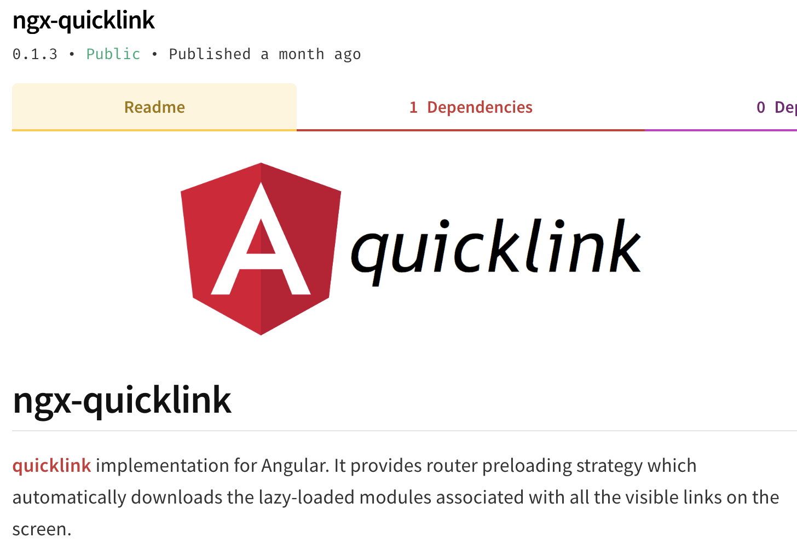
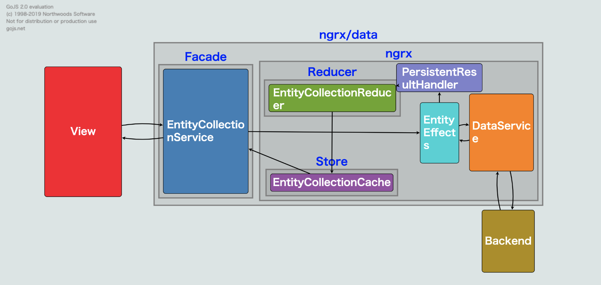

import { Card } from '@fusuma/client';

<!-- sectionTitle: Angular Meetup feat. Minko Gechev from Angular team -->
<!-- note
Angular Meetup
- Minko Gechev
  - GoogleのAngularチームの人
- JiaLi Passion
  - Angular Collaborator
  - Zone.jsをつくった人

Zone.jsはAngularの非同期処理のユーティリティライブラリ
-->

<Card
  left={}
  right={
    

        <h2>Angular Meetup</h2>
        <ul>
            <li>
Minko Gechev

                <ul>
                    <li>GoogleのAngularチームの人</li>
                </ul>
            </li>
            <li>
JiaLi Passion

                <ul>
                    <li>Angular Collaborator</li>
                    <li>Zone.jsをつくった人</li>
                </ul>
            </li>
        </ul>
    

  }
/>

---

<!-- note
- WebアプリケーションのフロントエンドではJSのダウロードサイズを小さくするのは重要
- Lazy loading
  - ルーティングごとに必要なモジュールだけを読み込む
- Preloading
  - モジュールの先読み
  - Angularは設定一つで有効になる
  - Predictive Prefetching (Guess.js)

特に初回読み込み。SEOでも重要。
lazy loading: Angularではアプリをモジュール単位に分割する。URLが切り替わる->必要なモジュールを読み込む
prefetching: バックグラウンドでJSをダウンロードしておく。
Angularは設定一つで有効になる -> 全てが先読みされる
Angularの設定だとページ上のすべてのリンクのモジュールが先読みされる
-->

## Tools for Fast Angular Applications

- WebアプリのフロントではJSのダウロードサイズを小さくするのは重要
- Lazy loading
  - ルーティングごとに必要なモジュールだけを読み込む
- Preloading
  - モジュールの先読み
  - Angularは設定一つで有効になる
  - Predictive Prefetching (Guess.js)

---
<!-- note
スクロール位置に見えているリンクのモジュールだけ先読みしてくれるすごいやつ
-->

<Card
  left={}
  right={
    

      <h2>ngx-quicklink</h2>
      
スクロール位置に<strong>見えている</strong>リンクの

モジュールだけ先読みしてくれるすごいやつ

    

  }
/>

---
<!-- note
Guess.js
- 現在アルファ版
- AngularだけでなくReactにも対応
- Google Analyticsを元に予測
- Markov Chainでグラフを作成し、RNNで学習
- ライブラリ自体、モデル共に軽量
-->

<Card
  left={
    

      
      
引用: https://blog.mgechev.com/2018/05/09/introducing-guess-js-data-driven-user-experiences-web/

    

  }
  right={
    

      <h2>Guess.js</h2>
        <ul>
          <li>AngularだけでなくReactにも対応</li>
          <li>Google Analyticsを元に予測</li>
          <li>Markov Chainでグラフを作成し、RNNで学習</li>
          <li>ライブラリ自体、モデル共に軽量</li>
        </ul>
    

  }
/>

---

<!-- note
My journey to ngrx/data
- ngrxをラップしたライブラリ
  - ngrxはAngularにおけるRedux
- Facadeパターンでngrxを隠蔽
- ソースコードを読むとngrxおよびRxJSのベストプラクティスが詰まっている
  - ngrxを使い始めるならおすすめ

ngrx, ReduxはFlux思想に基づいた状態管理ツール
-->

<Card
  left={
    

      
      
引用: https://slides.com/jiali/deck-5#

    

  }
  right={
    

      <h2>My journey to ngrx/data</h2>
        <ul>
          <li>
ngrxをラップしたライブラリ

            <ul>
              <li>ngrxはAngularにおけるRedux</li>
            </ul>
          </li>
          <li>
ngrx / RxJSのベストプラクティスが詰まっている

            <ul>
              <li>ngrxを使い始めるならおすすめ</li>
            </ul>
          </li>
        </ul>
    

  }
/>

---

<!-- note
- 英語わからん
- 質疑応答は通訳あった
- 新鮮な情報、ここでしか聞けない情報が聞けた
- 直接要望を伝えることができるのはつよい

数日前の開発状況や次のバージョンの情報、Angularチーム内のことなど
Angularチームの人数
angular-eslint
-->

## Angular Meetupを参加してみて

- 英語わからん
- 質疑応答は通訳あった
- 新鮮な情報、ここでしか聞けない情報が聞けた
- 直接要望を伝えることができるのはつよい

