import { Card, Img } from '@fusuma/client';

<!-- sectionTitle: builderscon -->
<!-- note
builderscon
- buildersconは、「知らなかった、を聞く」 をテーマとした技術を愛する全てのギーク達のお祭りです
- 前夜祭を含めると3日間開催された
- 技術の幅が広い
  - ジャンルは何でもあり
- 発表の質が高い
  - プロポーザルを出して選考を通らなければならない

聞いた中で特に面白いと感じたセッションを３つ紹介

目的: 面白そうだから。まずイベントのコンセプトが面白そう。
普段自分の専門領域を深めに勉強会などに行くが、単純に面白そうなことに出会いたいと思った
-->
<Card
  left={
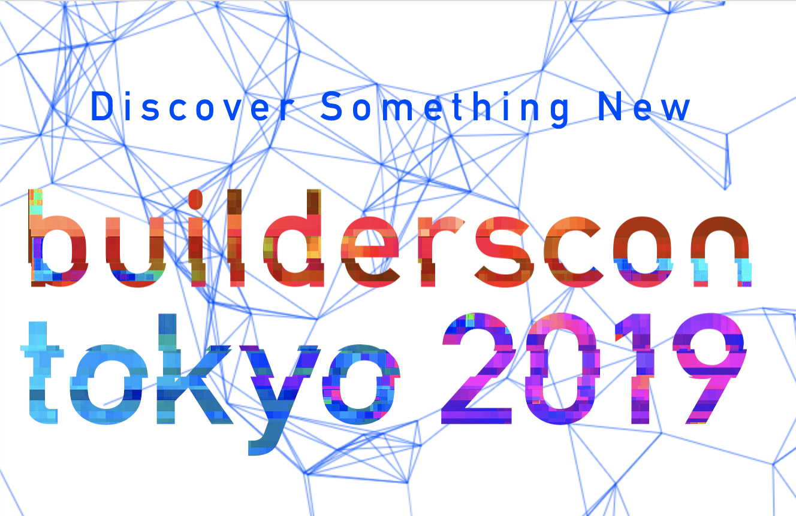
}
  right={
    

      <h2>builderscon</h2>
        <ul>
          <li>「知らなかった、を聞く」 技術者の祭典</li>
          <li>前夜祭を含めると3日間開催された</li>
          <li>
技術の幅が広い

            <ul>
              <li>ジャンルは何でもあり</li>
            </ul>
          </li>
          <li>
発表の質が高い

            <ul>
              <li>プロポーザルを出して選考を通らなければならない</li>
            </ul>
          </li>
        </ul>
    

  }
/>

---
<!-- note
対戦ゲームに学ぶ、フレームワークの設計技法とAIのアルゴリズム入門 by qsona
- 対戦ゲームのルールを定式化
- 定式化するとゲームのAIに活かせる
- boadgame.ioに学ぶフレームワーク設計の勘所
-->
<h2>
対戦ゲームに学ぶ、
フレームワークの設計技法とAIのアルゴリズム入門 by qsona</h2>

- 対戦ゲームのルールを定式化
- 定式化するとゲームのAIに活かせる
- boadgame.ioに学ぶフレームワーク設計の勘所

---

<!-- note
対戦ゲームのルールを定式化
- ターン制のゲームは状態(局面)とMove(指し手)の組み合わせで表現できる
  - 初期状態
  - 終了条件と結果(勝敗)
- ただし、(将棋の場合)ルールが曖昧で完全に定式化できない
  - 「最後の審判」(1997)

将棋だと局面は9x9のマスとコマの配置、持ち駒など
最後の審判: 詰将棋、現行のルールでは勝ち負けが不定となるのが定説とされる

-->

## 対戦ゲームのルールを定式化

- ターン制のゲームは状態(局面)とMove(指し手)の組み合わせで表現できる
  - 初期状態
  - 終了条件と結果(勝敗)
- ただし、(将棋の場合)ルールが曖昧で完全に定式化できない
  - 「最後の審判」(1997)

---

<!-- note
定式化するとゲーム木という木構造で表せる
- 状態(局面)がノード、Move(指し手)が枝
- ゲームの面白さを表せるのではないか
  - 一方的なゲーム(消化試合)
  - 緊張感が持続するゲーム

-->

<Card
  left={
    

      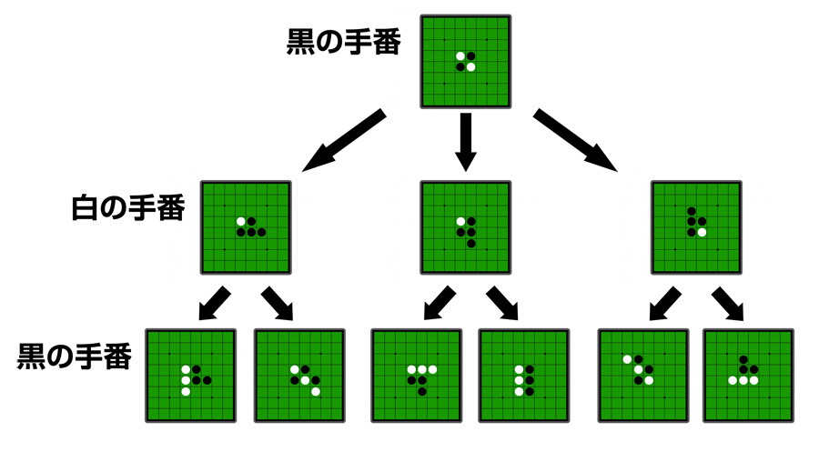
      
引用: https://www.webcyou.com/?p=6997

    

  }
  right={
    

      <h3>定式化するとゲーム木で表せる</h3>
        <ul>
          <li>状態(局面)がノード、Move(指し手)が枝</li>
          <li>
            
ゲームの面白さを表せるのではないか

            <ul>
              <li>一方的なゲーム(消化試合)</li>
              <li>緊張感が持続するゲーム</li>
            </ul>
          </li>
        </ul>
    

  }
/>

---
<!-- note
一方的なゲーム 消化試合の場合
青が自分。自分がどの手を選んでも最終局面では勝ちを選ぶことができる
-->

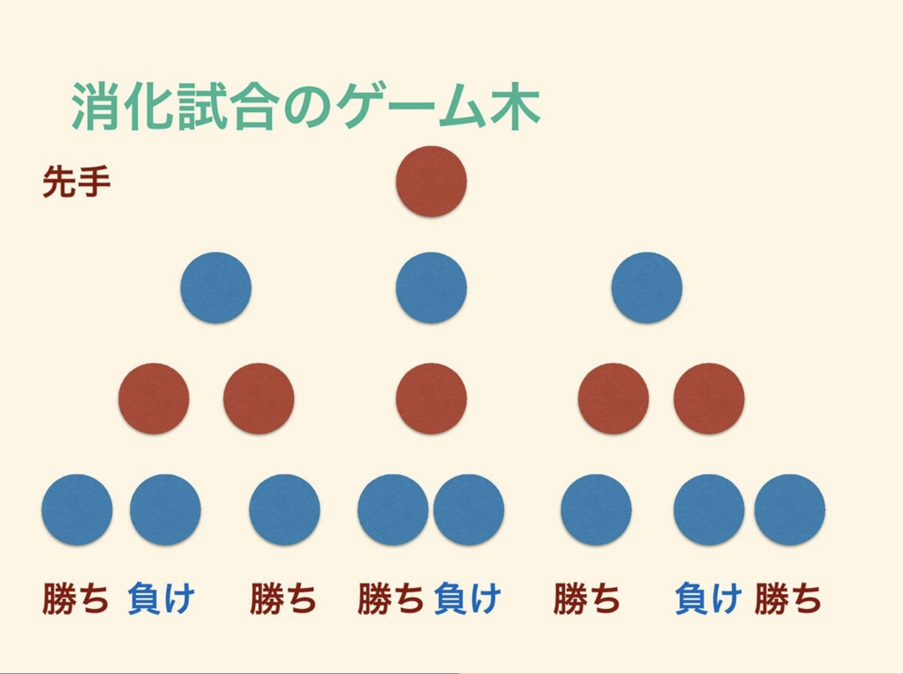
 

引用: https://speakerdeck.com/qsona/game-model

---

<!-- note
緊張感が持続する持続する試合の場合

最初、一見一番左を選べば勝てる確率が高いが
相手の選択によっては負けを選ぶしかなくなる
この場合右を選ぶといい (勝ちを選べる)
-->

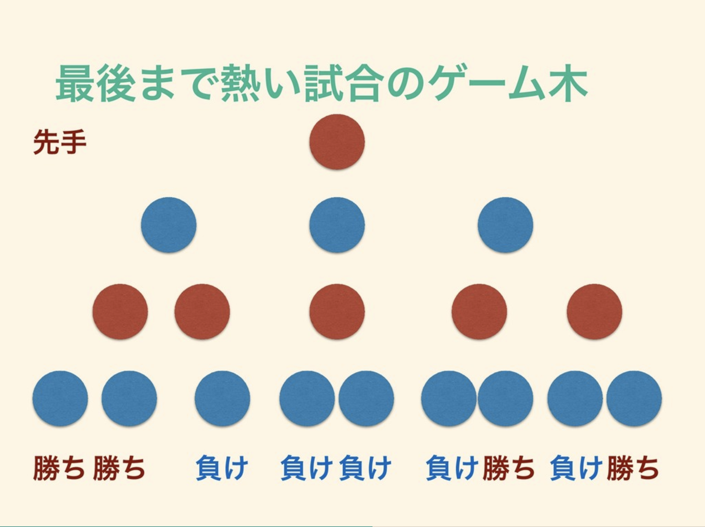
 

引用: https://speakerdeck.com/qsona/game-model

---

<!-- note
  - モンテカルロ木探索
    - とりあえず、ゲーム終了まで何回も試行する
    - 勝率が高い手を選ぶ
  - いくつかの戦略を一定の割合で混ぜると強い(例：ポーカーで2割ブラフ)
  - 将棋は完全解析不能なので評価関数が命
  - 
-->

## AIアルゴリズムの話

- モンテカルロ木探索
  - とりあえず、ゲーム終了まで何回も試行する
  - 勝率が高い手を選ぶ
- いくつかの戦略を一定の割合で混ぜると強い
- 将棋は完全解析不能なので評価関数が命

---

<!-- note
- boadgame.ioに学ぶフレームワーク設計の勘所
  - boadgame.io
    - ターン制のゲームを作るためのフレームワーク
    - JavaScript, Node.js, React, TypeScript
-->

## boadgame.ioに学ぶフレームワーク設計の勘所

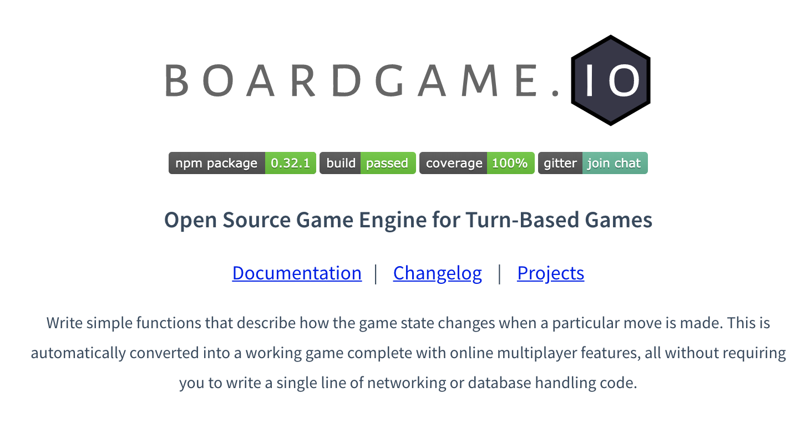

---

<!-- note
主な機能。特筆すべきは状態管理とゲームフェーズ。
  - (将棋) 局面を状態(G)として管理、指し手の履歴もゲームの状態に含まれる
    - 履歴がないと千日手の判定ができない
  - PDS (プレゼンテーションとドメインの分離)
  - 簡易AIの自動生成(モンテカルロ木ベース)
-->

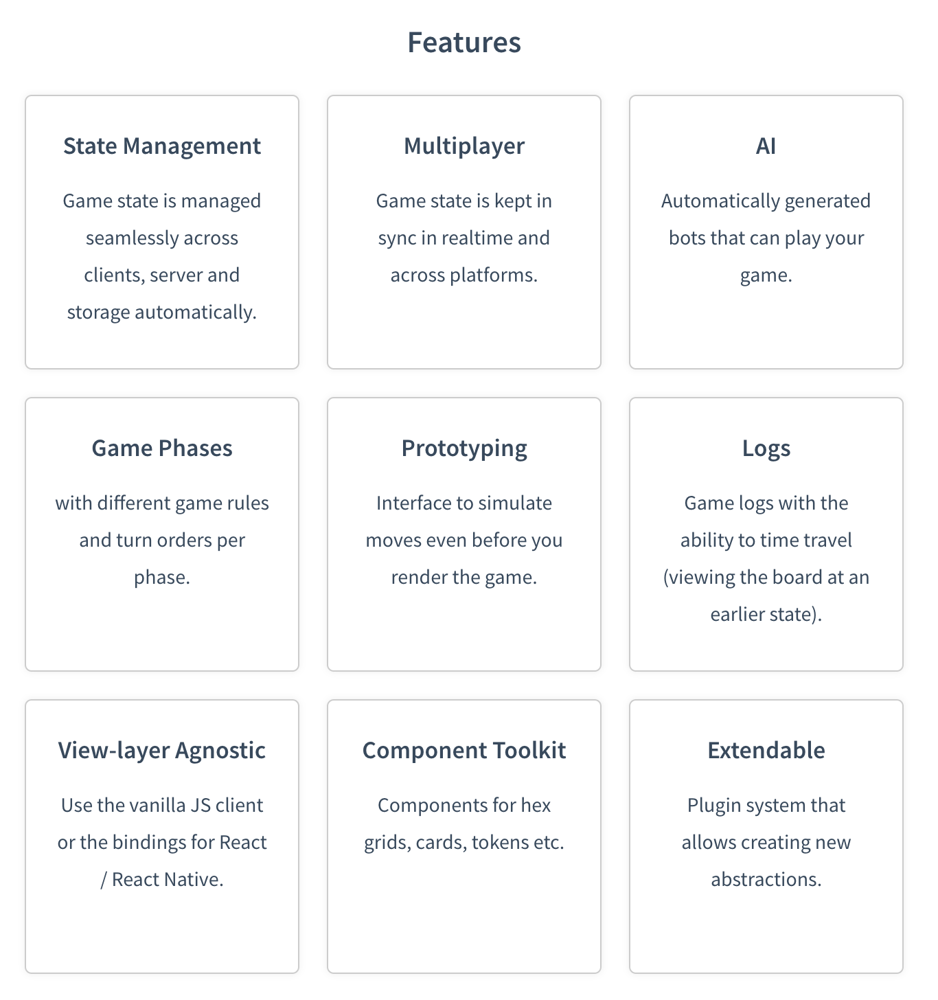

---

<!--
良いフレームワークとは
- 扱う対象は広いが広すぎない
- 対象の構造を適切に捉えていて頑健性がある
- エコシステムの充実
-->

## 良いフレームワークとは
- 扱う対象は広いが広すぎない
- 対象の構造を適切に捉えていて頑健性がある
- エコシステムの充実

---

<!-- note
コンパイラをつくってみよう by DQNEO
- ライブコーディング形式のセッション
    - 実際は会場全体でモブプロ状態だった
- 式を入力として演算結果の数値を主力するコンパイラ
  - 例: '30 + 12' -> 42
- ソースコードを標準入力で受け取って、アセンブリを標準出力に吐く
- フルスクラッチでコンパイラを作るところライブコーディング
-->

## コンパイラをつくってみよう by DQNEO

- ライブコーディング形式のセッション
- 式を入力として演算結果の数値を主力するコンパイラ
  - 例: '30 + 12' -> 42
- ソースコードを標準入力で受け取って、アセンブリを標準出力に吐く

---

<!-- note
30をaレジスタに書き込む
12をcレジスタに書き込む
aレジスタとcレジスタを加算する
-->

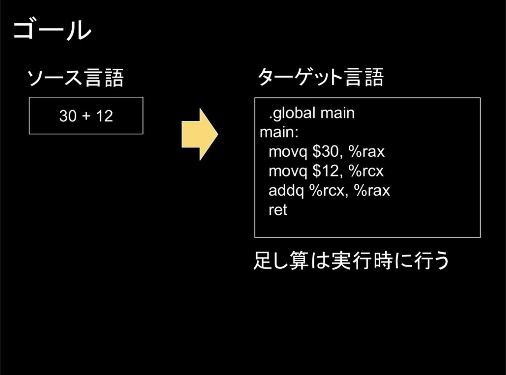
 

引用: https://speakerdeck.com/dqneo/how-to-make-a-compiler

---

スライドによる解説とライブコーディングが織り交ぜられて

わかりやすいセッションだった

---

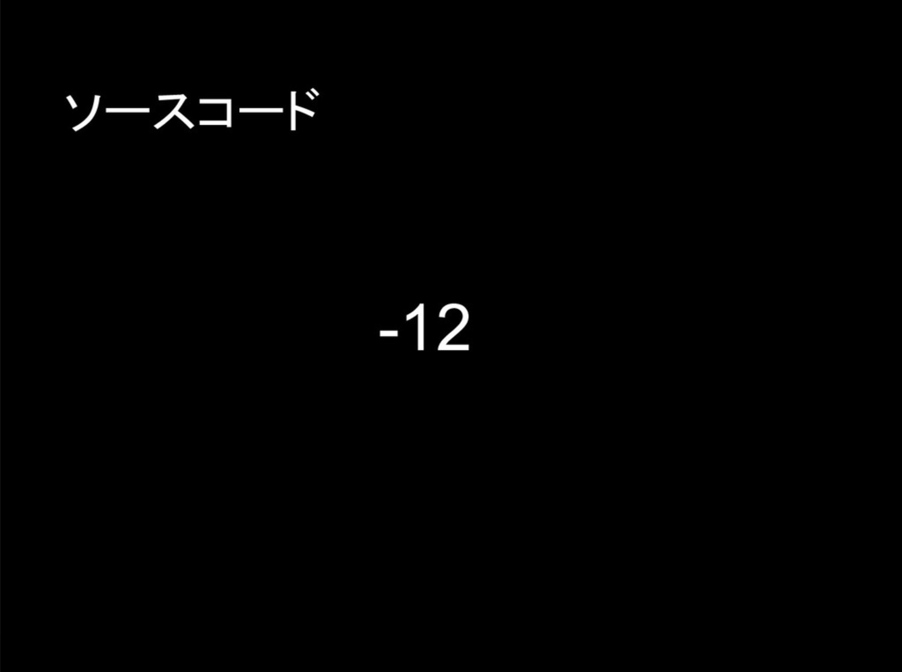
 

引用: https://speakerdeck.com/dqneo/how-to-make-a-compiler

---

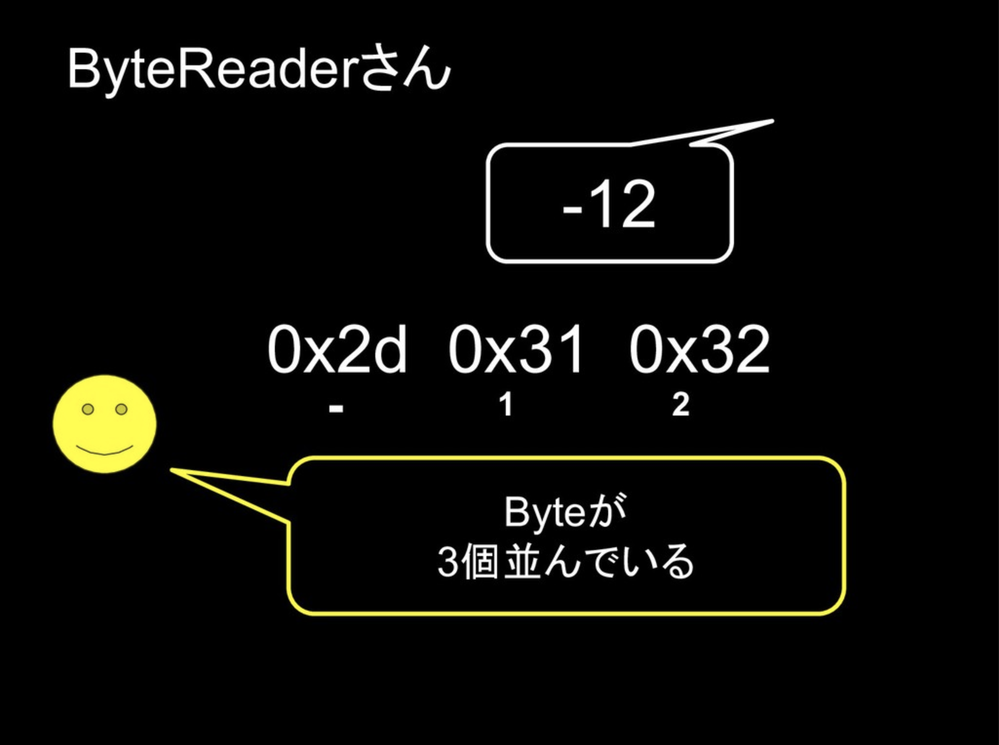
 

引用: https://speakerdeck.com/dqneo/how-to-make-a-compiler

---

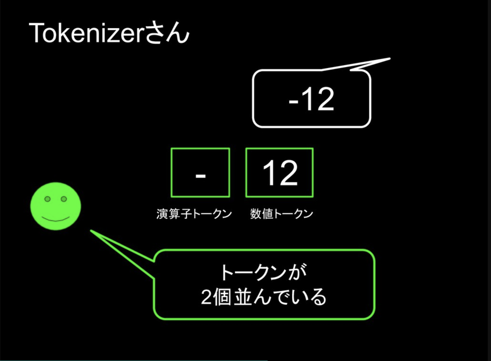
 

引用: https://speakerdeck.com/dqneo/how-to-make-a-compiler

---

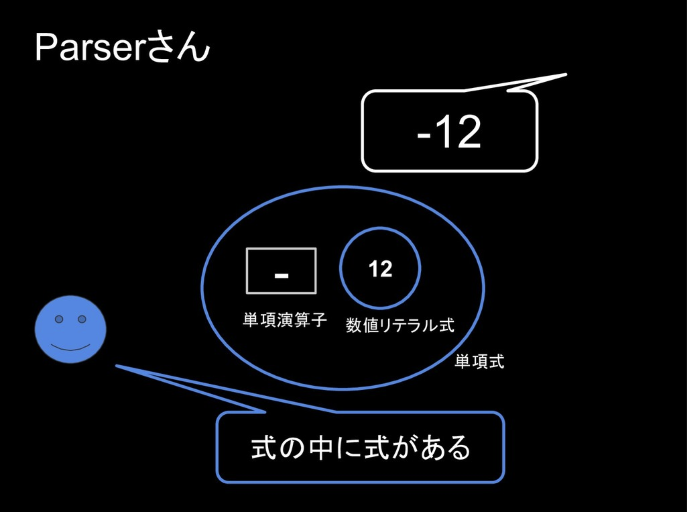
 

引用: https://speakerdeck.com/dqneo/how-to-make-a-compiler

---

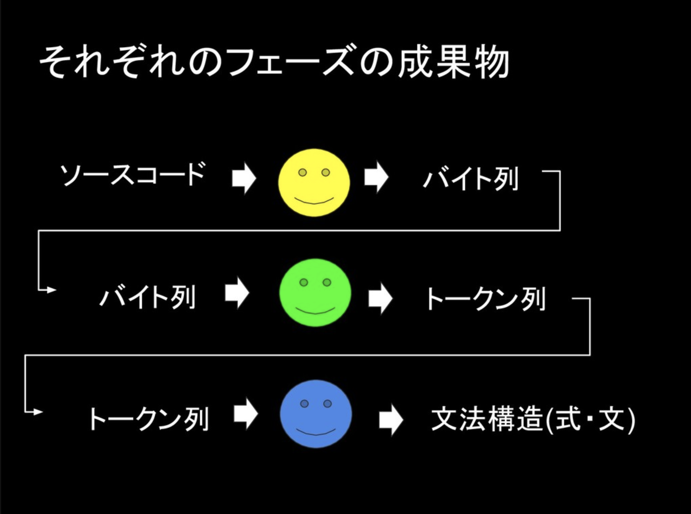
 

引用: https://speakerdeck.com/dqneo/how-to-make-a-compiler

---

<!-- note
- 言語はなんでもよい
- コンパイラをつくりはじめるのに特殊な知識はいらない
- 作りながら学ぶというやり方がおすすめ
- 今ならchibiccを写経するのがいい
-->

- 言語はなんでもよい
- コンパイラをつくりはじめるのに特殊な知識はいらない
- 作りながら学ぶというやり方がおすすめ
- 今ならchibiccを写経するのがいい

---

<!-- note
Oxygen Not Included: Making a Game That Inspires Science by Ipsquiggle

- 物理学や科学のルールを持ち込んだシミュレーションゲーム
- 街づくり + サバイバルがコンセプト(シムシティに代表されるジャンル)
- の開発者が登壇

- 物理法則
  - 重力
  - 熱伝導
  - 副作用
- 電球をつけたい -> 発電機を作る -> 熱と二酸化酸素という副作用が出る
- ONIは科学するということを内発的に動機づけるゲーム
  - ゲーム上の試行錯誤: 仮説を立てる -> 実験 -> 考察 の繰り返し
  - プログラミングの醍醐味に通づる物がある
-->

<Card
  left={

}
  right={
    

      <h3>Oxygen Not Included</h3>
        <ul>
          <li>物理学や科学のルールを持ち込んだシミュレーションゲーム</li>
          <li>街づくり + サバイバルがコンセプト(例: シムシティ)</li>
          <li>の開発者が登壇</li>
        </ul>
    

  }
/>

---

---

<!-- note
ほかにも面白い(面白そうだった)発表がたくさんあった
- PHPでJVMをつくった人
- 自動作曲入門
- Kyash, メルペイのアーキテクチャ
- スーパーカミオカンデの開発裏話
- webpack / Babelがどう動いているか解説
-->

## ほかにも面白い(面白そうだった)発表がたくさんあった
- PHPでJVMをつくった人
- 自動作曲入門
- Kyash, メルペイのアーキテクチャ
- スーパーカミオカンデの開発裏話
- webpack / Babelがどう動いているか解説

---
<!-- note
豪華なディナー
-->

---

<!-- note
最後にbuildersconで一番心に残った言葉で締める
コンパイラを作ろうセッションの質問タイムにて
Q. コンパイラを作るモチベーションの維持はどうしたのか？
A. コンパイラ作りが終わるまで他のことはやらないと決めた
   作り終わらなかったら何も成し遂げられないまま一生を遂げてしまう
面白いもの新しく興味が出たものがたくさん見つかったけど、まずはアプリ制作がんばろうと思う
-->

